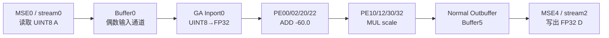
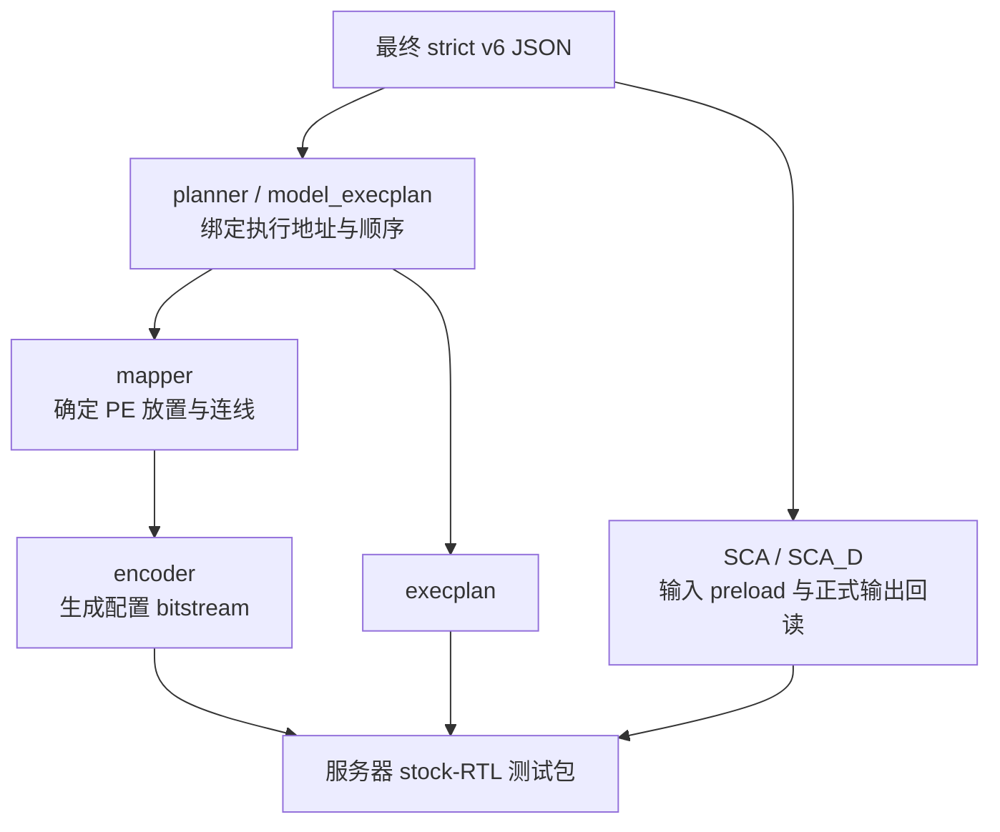

# DequantizeLinear node0077/v6 配置与三方验证学习说明

## 1. 文档目的

本文以 ResNet50 INT8 中已经完成本地验证、服务器 E4/E5 重复验证和三方逐 bit 对照的 `DequantizeLinear` 算子为例，说明：

- 算子的精确数学语义；
- 最终 JSON 配置应从哪里阅读；
- JSON 中 GA、Buffer、Loop、MSE stream 等部分如何配合；
- 逻辑张量如何映射到 28 个物理 slice；
- JSON 如何生成 mapping、bitstream、execplan、SCA 和 SCA_D；
- 本地配置绑定仿真、服务器硬件仿真和 W3 golden 如何形成三方闭环；
- 学习或复核时容易混淆的地址域、尾部填充和证据边界。

本文只解释已经冻结并通过验证的资产，不修改配置、RTL、测试包或历史回传。

## 2. 先看哪个 JSON

### 2.1 最终语义配置

学习本算子时，首先阅读：

[`configs/native_ndp_sim/resnet50_dequant_node0077_uint8_fp32_strict_v6/config.json`](../configs/native_ndp_sim/resnet50_dequant_node0077_uint8_fp32_strict_v6/config.json)

- 角色：最终、严格、未绑定全局执行地址的算子 JSON。
- SHA-256：`72c871e3bb4583302961ead62cabefa8b125281be97b5df61b45a190f18998bb`
- 文件大小：12,374 bytes。
- 算子身份：`r5:hwop-0077-00` / `node-0077`。

这是理解算子语义和硬件配置的主入口。后文所说“最终 JSON”，默认指该文件。

### 2.2 服务器 E5 包中的冻结副本

服务器 E5 包中保存了一份与最终 JSON 逐字节相同的副本：

[`artifacts/operator_config_validation/r5-server-test-packages/dequant_node0077_stockrtl_e5_onecmd_v1/validation/strict_config.json`](../artifacts/operator_config_validation/r5-server-test-packages/dequant_node0077_stockrtl_e5_onecmd_v1/validation/strict_config.json)

它与上面的最终 JSON 大小、SHA-256 完全一致。该副本用于证明服务器测试包消费的是已验收配置，不应作为新的配置源单独修改。

### 2.3 地址绑定后的执行 JSON

完整执行链还会产生地址绑定版本：

[`artifacts/operator_config_validation/r5-dequant-node0077-e2-v6/tool-a/model_execplan/output/dq77/dq77_withbaseaddr.json`](../artifacts/operator_config_validation/r5-dequant-node0077-e2-v6/tool-a/model_execplan/output/dq77/dq77_withbaseaddr.json)

- SHA-256：`e75a1b6fcb1a3b5d83896255b59d77d8d05ab51a34350aab17044c94d6409ccf`
- 角色：加入执行地址等派生信息后的完整执行图。

其中物化后的单算子 JSON 是：

[`artifacts/operator_config_validation/r5-dequant-node0077-e2-v6/tool-a/model_execplan/output/dq77/jsons/op0_resnet50_dequant_node0077_uint8_fp32.json`](../artifacts/operator_config_validation/r5-dequant-node0077-e2-v6/tool-a/model_execplan/output/dq77/jsons/op0_resnet50_dequant_node0077_uint8_fp32.json)

- SHA-256：`77d7024fd9584ea2b12113a82dc20d3c541fe14ca6ed2965b96d5d2117a55731`
- 角色：供后端生成链消费的地址绑定算子配置。

地址绑定文件与最终严格 JSON 的职责不同，因此二者 SHA 不应相同。不能把地址绑定版本冒充原始最终配置，也不能只比较整个文件的 SHA 就误判语义漂移。

## 3. 算子语义

### 3.1 ONNX 语义

本节点的 ONNX 名称为：

```text
resnetv17_dense0_fwd_DequantizeLinear
```

逻辑输入和输出均为 `[16, 1000]`：

- 输入类型：`UINT8`
- 输出类型：`FP32`
- zero point：`60`
- scale：`0.12635107338428497`
- scale 的 FP32 bit pattern：`0x3e01622d`

必须实现的 W3 精确语义为：

```text
y = (float32(uint8(x)) - 60.0f) * float32(scale)
```

其中：

```text
-60.0f          = 0xc2700000
scale           = 0x3e01622d
```

### 3.2 为什么必须分成两级

硬件配置使用两级 GA 运算：

```text
UINT8 x
   │
   ├─ uint8 → fp32
   │
   ▼
ADD：x + (-60.0f)
   │
   ▼
MUL：上一级结果 × scale
   │
   ▼
FP32 y
```

不能把它改写成单级仿射形式：

```text
x * scale + (-60 * scale)
```

虽然两个表达式在实数数学上等价，但 FP32 的舍入位置不同。本项目的离线验证表明，单级改写与 W3 golden 在 16,000 个元素中会产生 12,976 个 bit mismatch；两级 `ADD → MUL` 则逐 bit 一致。

因此，“两级结构”不是性能上的随意选择，而是精确复现参考语义所必需的配置约束。

## 4. JSON 配置结构

最终 JSON 可以按以下数据流理解：



### 4.1 GA 输入转换

`ga_inport_configs` 中的 inport0 开启：

```text
uint8tofp32 = true
```

其通道 mask 为：

```text
[1, 0, 1, 0, 1, 0, 1, 0]
```

输入数据从 GA 偶数位置进入。这里的转换必须发生在减 zero point 之前，才能实现 `float32(uint8(x)) - 60.0f`。

### 4.2 第一级：减 zero point

配置中的四个 ADD PE 为：

```text
PE00, PE02, PE20, PE22
```

每个 PE：

- 一个输入来自 Buffer0；
- 另一个输入是常数 `0xc2700000`，即 `-60.0f`；
- 运算结果等价于 `float32(x) + (-60.0f)`。

### 4.3 第二级：乘 scale

配置中的四个 MUL PE 为：

```text
PE10, PE12, PE30, PE32
```

它们分别消费上一级：

```text
PE00, PE02, PE20, PE22
```

第二输入是常数：

```text
0x3e01622d
```

即最终 scale。

### 4.4 输出路径

该算子只使用 normal outbuffer，不使用特殊 transout 路径。GA outport mask 为：

```text
[0, 1, 0, 1, 0, 1, 0, 1]
```

输出进入 Buffer5，再由 MSE4 的 stream2 写回 DRAM。输出已经是 FP32，因此 outport 不再进行额外数据类型转换。

### 4.5 Buffer 配置

| Buffer | 用途 | 关键配置 |
|---|---|---|
| Buffer0 | 输入 A | `buf_end_row_addr=0`，`buf_full_last_index=3`，偶数通道 mask |
| Buffer5 | 输出 D | `buf_end_row_addr=3`，`buf_full_last_index=3`，奇数通道 mask |

Buffer5 的 row 范围为 `0..3`，正好容纳一次 64-byte FP32 输出事务的四条 16-byte 行。

### 4.6 v6 的关键修正

最终 v6 中最重要的动态修正是：

```text
buffer_loop_configs.GROUP2.ROW_LC.end = 4
```

原因是 stream2 每次写出 64 bytes：

```text
4 rows × 16 bytes/row = 64 bytes
```

早期配置把 `end` 设为 `1`，只向输出路径供应一条 16-byte 行。服务器原子测试因此表现为：

- 每片只写出预期 4 个 beat 中的第 1 个；
- 后续 3 行没有有效写入；
- slice finish 时仍有未清空的地址事务。

这被裁决为配置行数供应不足，而不是 RTL 缺陷。v6 改为 `end=4` 后，最小原子测试和完整 28-slice 测试均得到完整输出。

## 5. Loop 与事务组织

### 5.1 Buffer loop

输入 GROUP0：

```text
target = A
ROW_LC.end = 1
COL_LC.end = 16
```

输出 GROUP2：

```text
target = D
ROW_LC.end = 4
COL_LC.end = 16
```

输入一次读取 16 个 UINT8，共 16 bytes；输出一次写回 16 个 FP32，共 64 bytes。

### 5.2 DRAM loop

关键循环关系为：

- `LC0`：终止根，`outmost_loop=1`、`end=1`；
- `LC1`、`LC3`：`end=47`；
- `LC2`、`LC4`：`end=1`。

最终形成每个 slice 47 个 occurrence：

```text
47 occurrences/slice × 16 elements/occurrence = 752 physical elements/slice
```

### 5.3 MSE0 输入 stream

stream0 负责读取 A：

| 项目 | 值 |
|---|---|
| JSON stream base | `0x00000000` |
| 每次事务 | 16 bytes |
| `dim_stride` | `[16, 16, 752]` |
| 数据类型 | UINT8 |

其 bank column 顺序为：

```text
[0,8,16,24,1,9,17,25,2,10,18,26,3,11,19,27]
```

### 5.4 MSE4 输出 stream

stream2 负责写回 D：

| 项目 | 值 |
|---|---|
| JSON stream base | `0x01800000` |
| 每次事务 | 64 bytes |
| `dim_stride` | `[64, 64, 3008]` |
| 数据类型 | FP32 |

其 bank column 顺序为：

```text
[4,5,6,7,12,13,14,15,20,21,22,23,28,29,30,31]
```

## 6. 逻辑张量到 28 个 slice 的布局

### 6.1 总体布局

最终布局 profile 为：

```text
w4_group4x7_batch_channel28_candidate_v1
```

硬件 CWH 为：

```text
[16, 47, 1]
```

28 个 slice 由下面两层拆分组成：

- 1000 个 feature 被分成 4 个 quarter，每个 250；
- 16 个 sample 被分成 7 个 sample group。

sample group 的容量为：

```text
3 + 3 + 2 + 2 + 2 + 2 + 2 = 16 samples
```

每个 sample group 配合 4 个 feature quarter，因此：

```text
7 groups × 4 quarters = 28 slices
```

### 6.2 每片数据大小

每个 slice 有 752 个物理槽位：

```text
750 prefix slots + 2 alignment-tail slots
```

因此：

| 区域 | 每片大小 |
|---|---:|
| A | 752 bytes |
| D | 752 × 4 = 3008 bytes |
| D 的 128-bit 行数 | 3008 / 16 = 188 行 |

输入 A 的最后两个 alignment byte 填 zero point：

```text
0x3c, 0x3c
```

经过 dequant 后，输出 D 的最后两个 FP32 必须是：

```text
0x00000000, 0x00000000
```

需要注意：对只容纳两个 sample 的 slice，750 个 prefix 槽位中还包含布局填充。不能把“750 个物理 prefix 输出”直接表述为“750 个不同逻辑元素”。最终 inverse 合同会剔除布局填充，并保证 16,000 个逻辑元素各取一次且不重复。

## 7. 地址域与 SCA

### 7.1 SCA 中的全局地址

全局 preload/readback 地址按 slice 分区：

```text
A_base(slice) = slice × 0x02000000
D_base(slice) = A_base(slice) + 0x000002F0
```

示例：

| Slice | A base | D base |
|---:|---:|---:|
| 0 | `0x00000000` | `0x000002F0` |
| 1 | `0x02000000` | `0x020002F0` |
| 27 | `0x36000000` | `0x360002F0` |

`0x2F0` 正好等于 752 bytes，所以 D 紧接在本 slice 的 A 区域之后。

SCA_D 对每个 slice 正式回读：

```text
188 × 128-bit rows = 3008 bytes
```

### 7.2 不要混淆三种地址

学习日志或 observer 时，应明确区分：

1. JSON stream 的局部/线性地址；
2. SCA/SCA_D 使用的全局物理 preload/readback 地址；
3. RTL 中经过 remap 后的本地 request 地址。

这三个地址属于不同层。直接把 post-remap request 地址与 JSON linear 地址比较，可能制造伪地址错误。正式数值结论应优先以 SCA_D 回读及其 layout inverse 为准。

### 7.3 执行控制

最终 SCA 的关键控制量为：

```text
Config_Base = 0x00001000
Exec_Base   = 0x00001400
Exec_Length = 29
Repeat_Num  = 1
```

execplan 的主要顺序是：

```text
Clock_Enable
Load_Config
Write_Reg × 54
Start_Comp
```

配置码流包含 52 个 64-bit word，execplan 按 128-bit 组织后为 29 行。

## 8. 从 JSON 到服务器执行资产

生成链可以概括为：



本轮 mapper 的关键信息：

- seed：`77`
- logical PE 数量：`8`
- placement penalty：`0`
- 未使用 fallback 或历史 cache。

本地 E2 报告：

[`artifacts/operator_config_validation/r5-dequant-node0077-e2-v6/local_e2_report.json`](../artifacts/operator_config_validation/r5-dequant-node0077-e2-v6/local_e2_report.json)

- SHA-256：`6a024f7da99026b977a4356909c99e7ac1635733fd95173a4f6741795cb965ee`
- 两次隔离生成得到字节一致的语义产物；
- planner、mapper、encoder、bitstream、execplan、SCA/SCA_D 都绑定到 v6 provenance。

服务器 E5 包中可直接查看的最终运行资产：

| 资产 | 位置 | SHA-256 |
|---|---|---|
| bitstream | [`.../cfg_pkg/op0_resnet50_dequant_node0077_uint8_fp32_bitstream_128b.bin`](../artifacts/operator_config_validation/r5-server-test-packages/dequant_node0077_stockrtl_e5_onecmd_v1/workload/runtime/payloads/cfg_pkg/op0_resnet50_dequant_node0077_uint8_fp32_bitstream_128b.bin) | `b67569ff8aa92bbf0f81286e475a047d12ff2ad20d97f73cf4a63eae8822a11f` |
| execplan | [`.../execplan.txt`](../artifacts/operator_config_validation/r5-server-test-packages/dequant_node0077_stockrtl_e5_onecmd_v1/workload/runtime/payloads/execplan.txt) | `af79d9a1ed7acc1ede0bf0fe6223e7826cc714489235dcca40b1846d7cff7910` |
| SCA | [`.../sca_cfg.json`](../artifacts/operator_config_validation/r5-server-test-packages/dequant_node0077_stockrtl_e5_onecmd_v1/workload/runtime/sca_cfg.json) | `2cb55916089b8912e7e7ed091268e488024d36b193c4744ffb656dbae2375808` |
| SCA_D | [`.../sca_cfg_D.json`](../artifacts/operator_config_validation/r5-server-test-packages/dequant_node0077_stockrtl_e5_onecmd_v1/workload/runtime/sca_cfg_D.json) | `df4371315840cae81be76b79d7e1ee60f3ccfd1491361002d3960f695ad3cb9e` |

源码生成物与服务器包中的文本文件可能只有 `CRLF` 与 `LF` 行尾差异。此类规范化必须由收据记录，不能仅凭二进制 SHA 不同就断言配置内容发生变化。

## 9. 验证闭环

### 9.1 本地 E2

本地 E2 负责证明：

- 最终 JSON 的语义约束成立；
- 两级 `ADD → MUL` 与 W3 公式逐 bit 一致；
- 地址、布局、尾部填充和 inverse 合同闭合；
- 后端生成物具有本轮 provenance；
- 两次隔离生成具有确定性。

E2 是本地静态/配置绑定证据，不能替代服务器动态结果。

### 9.2 服务器 E4

E4 分析文件：

[`server_returns/dequant_node0077_stockrtl_e4_onecmd_v2_return_analysis_20260727.json`](../server_returns/dequant_node0077_stockrtl_e4_onecmd_v2_return_analysis_20260727.json)

- SHA-256：`c7d1380f6dd365b6349e050390a5e112125906eb04a73fcd54a3dec412bfe35f`
- compile/sim/run：`0/0/0`
- 28/28 slice 自然完成；
- 正式回读 `28 × 188 = 5264` 条 128-bit D；
- raw request：5264；
- raw write-data：5264；
- 每片有效数据与 golden 逐 bit 一致；
- 每片最后两个 FP32 均为 `+0.0`；
- stock RTL 身份检查通过；
- 分类：`FIRST_DYNAMIC_PASS`。

### 9.3 服务器 E5

E5 使用全新的 package/install/run/return 身份重复相同门：

[`server_returns/dequant_node0077_stockrtl_e5_onecmd_v1_return_analysis_20260727.json`](../server_returns/dequant_node0077_stockrtl_e5_onecmd_v1_return_analysis_20260727.json)

- SHA-256：`544761cb91681f1b45a611ef92f05de49e771bb354da3c8a43817a8ca0b7728d`
- compile/sim/run：`0/0/0`
- 28/28 slice 自然完成；
- 5264 条正式 D 回读全部通过；
- 完整 inverse 后的 `[16,1000]` 与 golden 逐 bit 一致；
- 身份、return exact-set 和恢复门通过；
- 分类：`REPEATED_DYNAMIC_PASS`。

E5 通过后，该节点才具备正式 target/candidate 晋升依据。

### 9.4 三方逐 bit 对照

三方闭环的机器报告：

[`artifacts/operator_config_validation/r5-dequant-node0077-config-bound-simulator-v1/three_party_report.json`](../artifacts/operator_config_validation/r5-dequant-node0077-config-bound-simulator-v1/three_party_report.json)

- SHA-256：`f0db3202d250bbba3b40ccd02731ad1a676938bca9e54a2a9de988c5798fde95`
- 状态：`THREE_PARTY_CONFIG_BOUND_CLOSURE_PASS`

配置绑定仿真合同：

[`contracts/operator_config/dequant_node0077_config_bound_simulator_v1.json`](../contracts/operator_config/dequant_node0077_config_bound_simulator_v1.json)

- SHA-256：`7cb0a7224944db5ee3b7e5b8bb3ccaedf5ee2f2e7f9673982bc2bee181c55c33`

三方分别是：

1. W3 独立 golden；
2. 配置绑定 PE 图执行器产生的 simulator 结果；
3. stock RTL 服务器 E4/E5 正式 D 回读经同一冻结 inverse 还原的结果。

六组两两比较全部覆盖 16,000 个 FP32 元素：

| 比较 | bit mismatch | 结果 |
|---|---:|---|
| golden vs simulator | 0 | PASS |
| golden vs E4 | 0 | PASS |
| golden vs E5 | 0 | PASS |
| simulator vs E4 | 0 | PASS |
| simulator vs E5 | 0 | PASS |
| E4 vs E5 | 0 | PASS |

比较参数为：

```text
atol = 0
rtol = 0
max_abs_error = 0
NaN count = 0
```

三方最终 `[16,1000]` FP32 结果的统一 SHA-256 为：

```text
d5aa938813ec8ef7fe51cc2288df5f0e1782c19729a184cef248718ce83a311d
```

这里使用的是“配置绑定 PE 图执行器”，它实际消费最终 JSON、mapping/bitstream、execplan、SCA/SCA_D、物理 A 布局并生成物理 D，再执行冻结 inverse；不是直接套用 Dequant 数学公式的替代 golden。RTL 的时序与控制正确性仍由 E4/E5 动态运行证明。

## 10. 如何正确理解“三方通过”

三方通过证明的是这一组冻结资产的闭环一致性：

```text
W3 golden
    = 配置绑定执行结果
    = 服务器 E4 stock-RTL 结果
    = 服务器 E5 stock-RTL 重复结果
```

它同时依赖：

- v6 最终 JSON；
- 本轮 mapping、bitstream 和 execplan；
- 固定的 28-slice 物理布局；
- 正确的 SCA 输入和 SCA_D 回读；
- 冻结的 layout inverse；
- 未修改的 stock RTL；
- E4/E5 各自独立的运行与身份收据。

因此不能从“三方通过”推出以下结论：

- 任意 Dequant 配置都自动正确；
- 单级 affine 改写也等价；
- 任意地址绑定或 layout 都可替换；
- E2 通过即可代替服务器动态验证；
- 只看到 `Simulation completed` 就等于数值通过；
- observer 的 request 数量可以代替正式 D 回读。

## 11. 推荐学习顺序

建议按下面的顺序阅读，避免一开始陷入地址和码流细节：

1. 阅读最终 strict v6 JSON，先找出 inport 转换、四个 ADD PE、四个 MUL PE、Buffer0、Buffer5 和 stream0/stream2。
2. 对照本文第 3、4 节，在纸上写出单个元素的数据流。
3. 查看 `GROUP2.ROW_LC.end=4`，理解一次 64-byte 输出为什么需要四条 16-byte buffer row。
4. 阅读本地 E2 报告，理解 JSON 到 mapping/bitstream/execplan/SCA 的 provenance。
5. 阅读 E4、E5 分析，确认“自然完成、正式回读、golden、身份”是相互独立的门。
6. 最后阅读三方报告，核对六组 pairwise comparison 和统一 inverse SHA。

## 12. 证据索引

| 用途 | 文件 |
|---|---|
| 最终配置主入口 | [`configs/native_ndp_sim/resnet50_dequant_node0077_uint8_fp32_strict_v6/config.json`](../configs/native_ndp_sim/resnet50_dequant_node0077_uint8_fp32_strict_v6/config.json) |
| 地址绑定执行图 | [`.../dq77_withbaseaddr.json`](../artifacts/operator_config_validation/r5-dequant-node0077-e2-v6/tool-a/model_execplan/output/dq77/dq77_withbaseaddr.json) |
| 地址绑定算子 JSON | [`.../jsons/op0_resnet50_dequant_node0077_uint8_fp32.json`](../artifacts/operator_config_validation/r5-dequant-node0077-e2-v6/tool-a/model_execplan/output/dq77/jsons/op0_resnet50_dequant_node0077_uint8_fp32.json) |
| 本地 E2 报告 | [`.../local_e2_report.json`](../artifacts/operator_config_validation/r5-dequant-node0077-e2-v6/local_e2_report.json) |
| 服务器 E4 分析 | [`server_returns/dequant_node0077_stockrtl_e4_onecmd_v2_return_analysis_20260727.json`](../server_returns/dequant_node0077_stockrtl_e4_onecmd_v2_return_analysis_20260727.json) |
| 服务器 E5 分析 | [`server_returns/dequant_node0077_stockrtl_e5_onecmd_v1_return_analysis_20260727.json`](../server_returns/dequant_node0077_stockrtl_e5_onecmd_v1_return_analysis_20260727.json) |
| 配置绑定仿真合同 | [`contracts/operator_config/dequant_node0077_config_bound_simulator_v1.json`](../contracts/operator_config/dequant_node0077_config_bound_simulator_v1.json) |
| 三方对照报告 | [`.../three_party_report.json`](../artifacts/operator_config_validation/r5-dequant-node0077-config-bound-simulator-v1/three_party_report.json) |
| 三方闭环任务记录 | [`.agents/task_records/20260727_dequant_node0077_config_bound_three_party_closure.md`](../.agents/task_records/20260727_dequant_node0077_config_bound_three_party_closure.md) |

截至本说明对应的冻结证据，Dequant node0077/v6 已完成本地 E2、服务器 E4、独立身份 E5 和配置绑定三方逐 bit 对照，当前该节点没有未解除 blocker。
